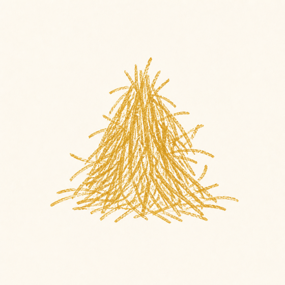
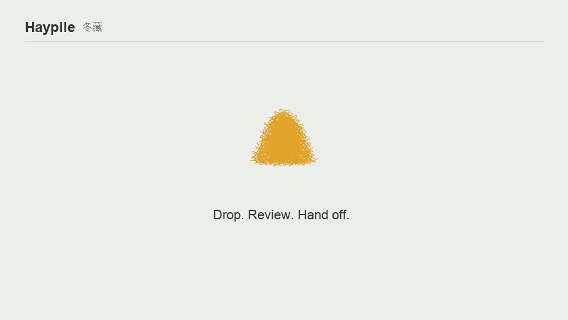

<div align="center">



# Haypile

**Drop it in the pile. Organize it, then hand it to your agent.**

A local-first asset intake for AI creators and independent developers.

[简体中文](README.zh-CN.md)


[](https://github.com/chenjinnan82-stack/Haypile-lite/actions/workflows/ci.yml)

</div>

## Download

No Python is required for the desktop test builds.

| Platform | Download | Notes |
| --- | --- | --- |
| macOS Apple Silicon | [App ZIP](https://github.com/chenjinnan82-stack/Haypile-lite/releases/download/v0.2.0-test.8/Haypile-v0.2.0-macos-arm64.app.zip) · [SHA-256](https://github.com/chenjinnan82-stack/Haypile-lite/releases/download/v0.2.0-test.8/Haypile-v0.2.0-macos-arm64.app.zip.sha256) | Ad-hoc signed; right-click **Open** |
| Windows x64 | [Portable ZIP](https://github.com/chenjinnan82-stack/Haypile-lite/releases/download/v0.2.0-test.8/Haypile-v0.2.0-windows-x64.zip) · [SHA-256](https://github.com/chenjinnan82-stack/Haypile-lite/releases/download/v0.2.0-test.8/Haypile-v0.2.0-windows-x64.zip.sha256) | Unsigned preview; SmartScreen may warn |

The repository currently contains the `v0.3.0-alpha.1` source candidate. New
desktop packages will replace the links above only after macOS and Windows
validation passes.

## See It Work



The pile stays fixed on the desktop. Click it for attached **Assets**, **Agent**,
and **Settings** drawers; drag a file onto it for intake.
The demo is rendered from the current Qt interface with repository-owned sample assets.

## Three Steps

1. **Drop** images from Finder, Explorer, or a browser. Audio remains supported.
2. **Review** the latest batch. Haypile hashes, deduplicates, registers, and can
   suggest image roles with a local model or an authorized API.
3. **Hand off** the latest ready batch to Codex or another agent through HTTP,
   MCP, or `asset-handoff.v1` JSON.

```text
Browser / desktop -> Haypile -> latest ready batch -> HTTP / MCP -> Agent
```

## Safety Boundary

Haypile is local-first by design:

- The service binds to `127.0.0.1` and static files are manifest-gated.
- Agents receive registered URLs and provenance, not filesystem access.
- HTTP and MCP are read-only; agent writes and deletes are not exposed.
- Remote AI requires explicit domain authorization and HTTPS outside localhost.
- API keys use macOS Keychain or Windows Credential Manager and never enter
  `gui_state.json`, logs, provenance, or handoff data.
- Cloud vision requests omit original filenames and local absolute paths.

See [Security Policy](SECURITY.md) for reporting security boundary failures.

## What v0.3 Adds

- Intake finishes before AI sorting, so an offline or slow model never blocks storage.
- Every drop has a stable batch ID; duplicates still belong to the new batch.
- Image roles include background, hero, logo, icon, content image, and texture.
- Local technical quality gates decide readiness; the model does not judge aesthetics.
- The Agent drawer can copy the latest batch instead of the whole asset library.
- AI modes are **Local model**, **API**, or **Off**. Audio metadata and manual
  usage confirmation continue to work without AI.

## Agent Access

The local backend defaults to `http://127.0.0.1:8010`.

```text
GET /healthz
GET /readyz
GET /api/v1/batches/latest
GET /api/v1/bundles?status=ready&batch_id=latest
GET /api/v1/bundles/{bundle_id}
```

Source-mode MCP configuration:

```json
{
  "mcpServers": {
    "haypile": {
      "command": "python3",
      "args": ["/absolute/path/to/Haypile-lite/mcp_server.py"],
      "env": {"HAYPILE_BASE_URL": "http://127.0.0.1:8010"}
    }
  }
}
```

Packaged apps use the Haypile executable with `--mcp`:

```json
{
  "mcpServers": {
    "haypile": {
      "command": "/Applications/Haypile.app/Contents/MacOS/Haypile",
      "args": ["--mcp"]
    }
  }
}
```

On Windows, set `command` to the absolute path of `Haypile.exe` and keep the
same `--mcp` argument. The Agent drawer can copy the correct configuration.

Read the [HTTP contract](docs/AGENT_HTTP_CONTRACT.md) and
[Agent recipes](docs/AGENT_RECIPES.md) for the complete handoff shape.

## Run From Source

```bash
git clone https://github.com/chenjinnan82-stack/Haypile-lite.git
cd Haypile-lite
python3 -m pip install -r requirements-desktop.txt
python3 app_gui.py
```

Headless smoke demo:

```bash
python3 -m pip install -r requirements-core.txt
python3 examples/public_smoke_demo.py --out /tmp/haypile-demo
```

Tests:

```bash
python3 -m unittest discover -s tests
```

Build notes live in [macOS internal build](docs/MACOS_INTERNAL_BUILD.md) and the
platform scripts under `scripts/`. The private release gate is documented in
[AI evaluation](docs/AI_EVALUATION.md).

## Project Notes

- This repository and its tagged releases are the only public Haypile source.
- Haypile is not a cloud DAM, multi-user sync service, or agent-write platform.
- Experimental real-project apply/rollback helpers remain disabled and outside
  the public agent surface.

Questions and reproducible product feedback belong in
[GitHub Issues](https://github.com/chenjinnan82-stack/Haypile-lite/issues).
Small, focused contributions are welcome; see [CONTRIBUTING.md](CONTRIBUTING.md).

MIT licensed. See [LICENSE](LICENSE) and [NOTICE](NOTICE).
