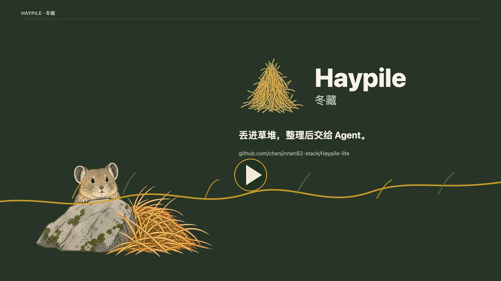
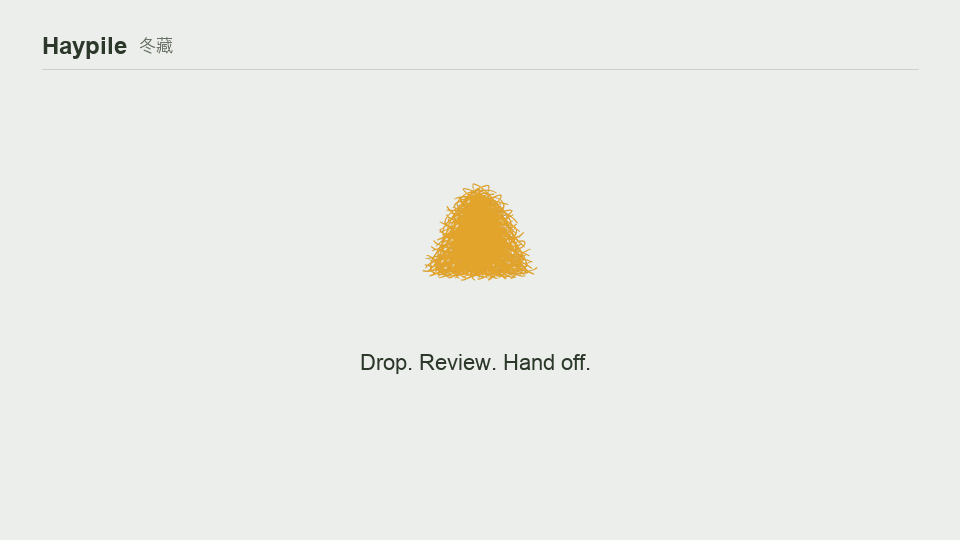

<div align="center">


# Haypile

**Drop it in the pile. Organize it, then hand it to your agent.**

A local-first asset intake for AI creators and independent developers.

[简体中文](README.zh-CN.md)


[](https://github.com/chenjinnan82-stack/Haypile-lite/actions/workflows/ci.yml)

</div>

## Desktop Downloads

`v0.3.0-alpha.8` is a prerelease for informed testing.

| Platform | Download | Verify |
| --- | --- | --- |
| macOS Apple Silicon | [Haypile.app.zip](https://github.com/chenjinnan82-stack/Haypile-lite/releases/download/v0.3.0-alpha.8/Haypile-v0.3.0-alpha.8-macos-arm64.app.zip) | [SHA-256](https://github.com/chenjinnan82-stack/Haypile-lite/releases/download/v0.3.0-alpha.8/Haypile-v0.3.0-alpha.8-macos-arm64.app.zip.sha256) |
| Windows x64 | [Portable ZIP](https://github.com/chenjinnan82-stack/Haypile-lite/releases/download/v0.3.0-alpha.8/Haypile-v0.3.0-alpha.8-windows-x64.zip) | [SHA-256](https://github.com/chenjinnan82-stack/Haypile-lite/releases/download/v0.3.0-alpha.8/Haypile-v0.3.0-alpha.8-windows-x64.zip.sha256) |

[Release notes](https://github.com/chenjinnan82-stack/Haypile-lite/releases/tag/v0.3.0-alpha.8)

> **Alpha.8 GIF and clipboard intake:** true GIF files can be dropped from the desktop,
> direct browser image URLs, or chat apps that expose an actual file attachment.
> The app also has an explicit clipboard action: exact GIF or file payloads keep
> their bytes, while pixel-only clipboard data is stored honestly as a static
> PNG. Low-volume original action sounds accompany navigation, intake,
> duplicates, and rejection and can be disabled independently. App-private
> animated emoji formats are not supported.

The macOS build is ad-hoc signed and not notarized; right-click the app and
choose **Open** on first launch. The Windows build is unsigned and portable;
unzip it before running `Haypile.exe`. Haypile keeps controlled local copies,
but an Alpha build must not be the only backup of material you cannot replace.

## 60-Second Overview

[](https://github.com/chenjinnan82-stack/Haypile-lite/releases/download/v0.3.0-alpha.6/Haypile-v0.3.0-alpha.6-product-overview-zh.mp4)

This is a Chinese-captioned product overview. The GIF below is the original
workflow illustration; current intake and attached-hub layouts are also
generated by the repository's offscreen visual smoke commands.

## See It Work



The pile stays fixed on the desktop. Click it for attached **Assets**, **Agent**,
and **Settings** drawers; drag a file onto it for intake.
The illustration uses repository-owned sample assets and does not read user material.

## Three Steps

1. **Drop** images from Finder, Explorer, or a browser. Audio remains supported.
2. **Review** the latest batch. Haypile hashes, deduplicates, registers, and can
   suggest image roles with a local model or an authorized API.
3. **Hand off** the latest ready batch to Codex or another agent through HTTP,
   MCP, or `asset-handoff.v1` JSON.

```text
Browser / desktop -> Haypile -> latest ready batch -> HTTP / MCP -> Agent
```

## Safety Boundary

Haypile is local-first by design:

- The service binds to `127.0.0.1` and static files are manifest-gated.
- Agents receive registered URLs and provenance, not filesystem access.
- HTTP and MCP are read-only; agent writes and deletes are not exposed.
- Remote AI requires explicit domain authorization and HTTPS outside localhost.
- API keys use macOS Keychain or Windows Credential Manager and never enter
  `gui_state.json`, logs, provenance, or handoff data.
- Cloud vision requests omit original filenames and local absolute paths.

See [Security Policy](SECURITY.md) or [report privately on GitHub](https://github.com/chenjinnan82-stack/Haypile-lite/security/advisories/new).

## What Main / Upcoming Alpha.8 Adds

- True GIF intake from local files, direct `image/gif` URLs, and file
  attachments, with original bytes preserved and strict frame-by-frame limits.
- One-loop GIF preview, manual reaction/sticker/UI-animation roles, and no GIF
  AI sorting. New GIFs stay pending until a role is confirmed.
- Explicit clipboard intake for files, exact GIF payloads, and safe direct
  media URLs. Pixel-only clipboard images are stored as static PNGs.
- Verified GIF MIME, frame count, declared duration, and loop count travel
  through the manifest, HTTP, MCP, and `asset-handoff.v1`.
- A Qt-free shared intake transaction and cross-process writer lock keep GUI
  intake and startup recovery from modifying the same open batch.
- Image, audio, and GIF entry motion now uses one reproducible renderer that can
  be verified offscreen without starting storage or the backend.
- The floating UI appears before storage hydration and backend startup. If
  storage is unavailable, intake stays disabled while Settings and Quit remain
  usable; shutdown only stops a backend owned by this GUI.
- The Assets drawer, pending badge, and service status share the same explicit
  storage configuration and manifest fail-close catalog. Experimental
  real-project workflows stay outside normal drawer startup.
- C-ring navigation, material rows, choices, and Settings controls expose native
  keyboard focus, checked state, and accessible descriptions; feedback colors
  distinguish progress, pending confirmation, duplicates, success, and errors.
- The selected Assets, Agent, or Settings action rotates to the drawer connector,
  while the attached panel stays clear of the action ring at either screen edge.
- Settings lookup no longer prepares product storage or creates IPC secrets;
  release CI and both package builds use the same exact Python and dependency
  constraints.
- A privacy-safe clipboard diagnostic reports only format names, sizes, and the
  selected route; app-private animated emoji remain unsupported.
- The empty Assets drawer points to drag and clipboard intake, while Settings
  can copy a privacy-safe runtime diagnostic without asset names, paths, URLs,
  hashes, or keys.
- Intake finishes before AI sorting, so an offline or slow model never blocks storage.
- Every drop has a stable batch ID; duplicates still belong to the new batch.
- Image roles include background, hero, logo, icon, content image, and texture.
- Local technical quality gates decide readiness; the model does not judge aesthetics.
- The Agent drawer can copy the latest batch instead of the whole asset library.
- AI modes are **Local model**, **API**, or **Off**. Audio metadata and manual
  usage confirmation continue to work without AI.

## Agent Access

The local backend defaults to `http://127.0.0.1:8010`.

```text
GET /healthz
GET /readyz
GET /api/v1/batches/latest
GET /api/v1/bundles?status=ready&batch_id=latest
GET /api/v1/bundles/{bundle_id}
```

Source-mode MCP configuration:

```json
{
  "mcpServers": {
    "haypile": {
      "command": "python3",
      "args": ["/absolute/path/to/Haypile-lite/mcp_server.py"],
      "env": {"HAYPILE_BASE_URL": "http://127.0.0.1:8010"}
    }
  }
}
```

Packaged apps use the Haypile executable with `--mcp`:

```json
{
  "mcpServers": {
    "haypile": {
      "command": "/Applications/Haypile.app/Contents/MacOS/Haypile",
      "args": ["--mcp"]
    }
  }
}
```

On Windows, set `command` to the absolute path of `Haypile.exe` and keep the
same `--mcp` argument. The Agent drawer can copy the correct configuration.

Read the [HTTP contract](docs/AGENT_HTTP_CONTRACT.md) and
[Agent recipes](docs/AGENT_RECIPES.md) for the complete handoff shape.

## Run From Source

```bash
git clone https://github.com/chenjinnan82-stack/Haypile-lite.git
cd Haypile-lite
python3 -m pip install -r requirements-desktop.txt
python3 app_gui.py
```

Headless smoke demo:

```bash
python3 -m pip install -r requirements-core.txt
python3 examples/public_smoke_demo.py --out /tmp/haypile-demo
```

Tests:

```bash
python3 -m unittest discover -s tests
```

Build notes live in [macOS internal build](docs/MACOS_INTERNAL_BUILD.md) and the
platform scripts under `scripts/`. The
[alpha.8 release notes](docs/OPEN_SOURCE_RELEASE.md) record the exact feature
and support boundary; the private release gate is documented in
[AI evaluation](docs/AI_EVALUATION.md).

## Project Notes

- This repository and its tagged releases are the only public Haypile source.
- Haypile is not a cloud DAM, multi-user sync service, or agent-write platform.
- Equal SHA-256 content is one logical asset. Haypile does not yet provide
  per-project identities, multiple simultaneous roles, or workspace isolation.
- Haypile keeps controlled copies, but it is not the only backup for valuable source material.
- Experimental real-project apply/rollback helpers remain disabled and outside
  the public agent surface.

Questions and reproducible product feedback belong in
[GitHub Issues](https://github.com/chenjinnan82-stack/Haypile-lite/issues).
Small, focused contributions are welcome; see [CONTRIBUTING.md](CONTRIBUTING.md).

MIT licensed. See [LICENSE](LICENSE) and [NOTICE](NOTICE).
